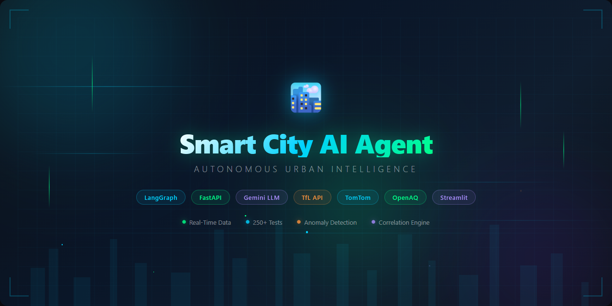
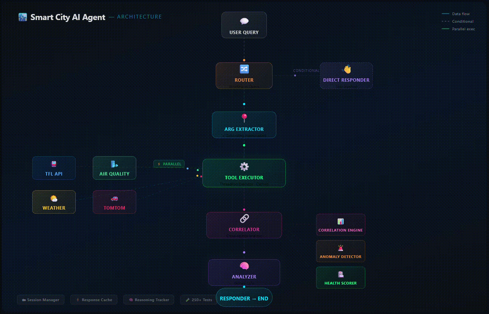

# 🏙️ Smart City AI Agent



An autonomous AI agent that answers questions about London city conditions by intelligently querying multiple real-time data sources, correlating patterns, detecting anomalies, and generating insightful analysis.

**Ask about any location in London** — streets, areas, landmarks — and the agent autonomously decides which APIs to call, fetches data in parallel, detects correlations (e.g., rain causing congestion), flags anomalies, and responds with a structured analysis.


---

## ✨ Key Features

### Autonomous Agent
- **LangGraph state machine** with 7-node reasoning pipeline
- **Parallel tool execution** — calls multiple APIs simultaneously via ThreadPoolExecutor
- **Conditional routing** — greetings skip the tool pipeline entirely
- **Conversation memory** — session-based context for follow-up questions
- **Argument extraction with geocoding** — resolves any London address to coordinates via Nominatim

### Intelligence Layer
- **Correlation engine** — cross-analyzes traffic × weather × air quality patterns
- **Anomaly detection** — threshold-based alerts (🚨 critical, ⚠️ warning, ℹ️ info)
- **City health score** — composite 0–100 score across traffic, tube, weather, air quality
- **Proactive insights** — endpoint that generates a full city report without a user question

### Real-Time Data Sources
| Source | API | Data |
|--------|-----|------|
| Transport for London | TfL API (free) | Tube status, road disruptions, road corridors |
| Weather | Open-Meteo (free) | Temperature, rain, wind, humidity, forecast |
| Air Quality | OpenAQ (free) | PM2.5, PM10, NO₂ readings with AQI |
| Traffic Flow | TomTom (free tier) | Real-time speed, congestion ratios, incidents |
| Geocoding | Nominatim/OSM (free) | Any London address → coordinates |

### Frontend Dashboard
- **Split-view layout** — chat (left) + live map & insights (right)
- **Live reasoning chain** — watch the agent think step-by-step as it processes
- **TomTom traffic flow tiles** — red/yellow/green overlay on the map
- **Health gauge** — Plotly gauge with per-category sub-scores
- **Anomaly alert cards** — color-coded with recommendations
- **Glassmorphism UI** — dark theme with blur effects

---

## 🏗️ Architecture
<!--  -->


---

## 🚀 Setup & Installation

### Prerequisites
- Python 3.11+
- Google Gemini API key ([get free key](https://aistudio.google.com/app/apikey))
- TomTom API key ([free tier](https://developer.tomtom.com/))
- OpenAQ API key ([free](https://explore.openaq.org/))

### Installation

```bash
# Virtual environment
python -m venv venv
venv\Scripts\activate        # Windows
# source venv/bin/activate   # Mac/Linux

# Install dependencies
pip install -r requirements.txt

# Configuration
copy .env.example .env
# Edit .env with your API keys
```

### Run

```bash
# Terminal 1: Backend
uvicorn app.main:app --reload

# Terminal 2: Frontend
streamlit run frontend/app.py
```

Open **http://localhost:8501** in your browser.

### Run Tests

```bash
pytest tests/ -v
```
### Demo

[🎥 Watch the Smart City AI Agent Demo](docs/images/Smart_City_AI_Agent_demo_video.mp4)

<video width="1080" height="720" controls>
  <source src="./docs/images/Smart_City_AI_Agent_demo_video.mp4" type="video/mp4">
  Your browser does not support the video tag.
</video>

---

## 💡 Example Queries

| Query | What the Agent Does |
|-------|-------------------|
| "How's the tube today?" | Checks all Underground line statuses |
| "Traffic near Baker Street" | Geocodes Baker Street → fetches TomTom flow data |
| "Why is traffic bad? Check weather too" | Calls traffic + weather + disruptions, correlates rain with congestion |
| "Compare traffic Canary Wharf vs City" | Parallel flow checks at both locations with comparison |
| "Full London overview" | All data sources + correlations + anomalies + health score |
| "Is it safe to run outside?" | Air quality check with health recommendation |
| "Will it rain in 6 hours?" | Weather forecast analysis |

---

## 🧪 Test Coverage (250+)

| Module | Tests | Coverage |
|--------|-------|----------|
| TfL wrapper | 16 | Tube, disruptions, road status, error handling |
| Weather wrapper | 12 | Current, forecast, weather codes |
| Air Quality wrapper | 10 | Stations, readings, AQI classification |
| TomTom wrapper | 14 | Flow, incidents, congestion classification |
| Agent nodes | 18 | Router, executor, correlator, analyzer |
| Sessions | 25 | Create, expire, TTL, cleanup, eviction |
| Correlation engine | 35 | Data extraction, all correlation pairs |
| Response cache | 18 | TTL, hits, errors, eviction |
| Anomaly detection | 35 | All thresholds, health scores |
| Reasoning tracker | 20 | Steps, config, example queries |
| API integration | 30 | HTTP endpoints, validation, lifecycle |
| Agent flow | 12 | Full graph, parallelism, error recovery |
| Geocoder | 18 | Resolution, caching, bbox, error handling |

---

## 🛠️ Tech Stack

| Component | Technology |
|-----------|-----------|
| Agent Framework | LangGraph (state machine with parallel execution) |
| LLM | Google Gemini (`gemini-2.5-flash`) |
| Backend | FastAPI + Uvicorn |
| Frontend | Streamlit + Folium + Plotly |
| Traffic Data | TfL API + TomTom API |
| Weather | Open-Meteo API |
| Air Quality | OpenAQ API |
| Geocoding | Nominatim (OpenStreetMap) |
| Caching | Custom TTL cache (thread-safe) |
| Testing | pytest (250+ tests) |

---

## 📁 Project Structure

```
Smart_City_AI_Agent/
├── app/
│   ├── config.py              # Centralized configuration
│   ├── main.py                # FastAPI application
│   ├── tools/
│   ├── agent/
│   │   ├── graph.py           # LangGraph agent
│   │   ├── state.py           # Agent state definition
│   │   ├── tools.py           # LangChain tool definitions
│   │   ├── correlation.py     # Cross-source correlation engine
│   │   ├── anomaly.py         # Anomaly detection + health scoring
│   │   ├── sessions.py        # Session manager
│   │   ├── cache.py           # Response cache
│   │   ├── reasoning.py       # Reasoning tracker + example queries
│   │   └── response_models.py # Structured response schemas
│   └── models/
│       └── schemas.py         # data models
├── frontend/
│   └── app.py                 # dashboard
├── tests/                     # 250+ tests
├── docs/
├── scripts/
│   ├── launch.ps1             # Launch both servers
│   └── test_agent_live.py     # Live agent test script
├── requirements.txt
├── .env.example
└── README.md
```

---

## 📖 Portfolio Narrative

> I started with ML-based traffic congestion prediction in my MSc Digital Twin project, then evolved the concept into an **autonomous AI agent** that integrates multiple city data sources in real-time.

This project demonstrates:

1. **AI Agent Architecture** — LangGraph state machine with conditional routing, parallel execution, and conversation memory
2. **System Design** — Clean separation of data layer (tool wrappers), intelligence layer (correlation + anomaly detection), and presentation layer (Streamlit)
3. **Production Patterns** — Response caching, graceful degradation, structured error handling, comprehensive testing (250+ tests)
4. **Data Engineering** — Multi-source data ingestion, standardized schemas, cross-source correlation
5. **Full-Stack Development** — FastAPI backend + Streamlit frontend with real-time UX (live reasoning chain, traffic map tiles)
